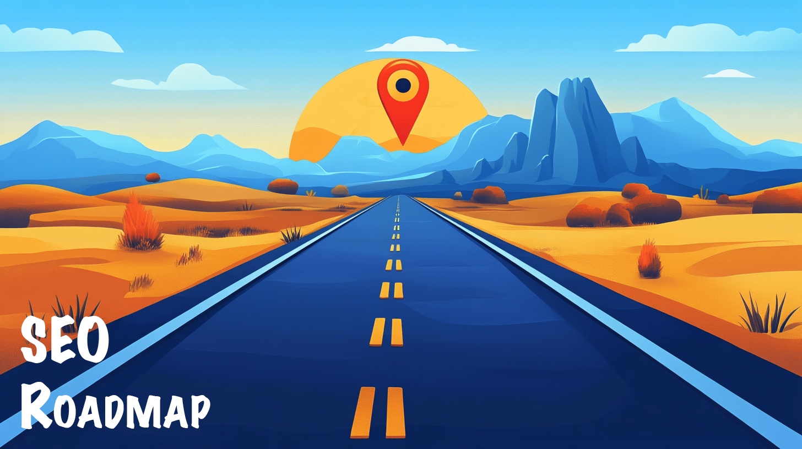

# SEO Roadmap

The **SEO Roadmap** is an exhaustive, step-by-step guide created to assist businesses, marketers, and website owners in developing and implementing an efficient and tailored SEO strategy. The ultimate goal is to improve search engine rankings, drive sustainable organic traffic, and maximize online visibility. This roadmap covers all critical aspects of SEO, ranging from **keyword research** and **on-page optimization** to **technical SEO**, **off-page SEO**, **content strategy**, and **ongoing SEO audits**. Following this guide ensures that every important SEO component is thoroughly addressed, allowing for a well-rounded and effective SEO strategy.

## Table of Contents

1. [Introduction](#introduction)
2. [Keyword Research](#1-keyword-research)
   - [Identify Seed Keywords](#11-identify-seed-keywords)
   - [Competitor Keyword Analysis](#12-competitor-keyword-analysis)
   - [Long-Tail Keyword Targeting](#13-long-tail-keyword-targeting)
   - [Keyword Prioritization](#14-keyword-prioritization)
3. [On-Page SEO](#2-on-page-seo)
   - [Title Tags](#21-title-tags)
   - [Meta Descriptions](#22-meta-descriptions)
   - [Header Tags (H1, H2, H3)](#23-header-tags-h1-h2-h3)
   - [URL Structure](#24-url-structure)
   - [Image Optimization](#25-image-optimization)
   - [Internal Linking](#26-internal-linking)
   - [Content Optimization](#27-content-optimization)
4. [Technical SEO](#3-technical-seo)
   - [Website Speed Optimization](#31-website-speed-optimization)
   - [Mobile Optimization](#32-mobile-optimization)
   - [XML Sitemaps](#33-xml-sitemaps)
   - [Robots.txt Configuration](#34-robots-txt-configuration)
   - [SSL/HTTPS Setup](#35-sslhttps-setup)
   - [Structured Data (Schema Markup)](#36-structured-data-schema-markup)
   - [Fixing Crawl Errors](#37-fixing-crawl-errors)
5. [Off-Page SEO](#4-off-page-seo)
   - [Link Building Strategies](#41-link-building-strategies)
   - [Social Media Engagement](#42-social-media-engagement)
   - [Local SEO Tactics](#43-local-seo-tactics)
   - [Brand Mentions](#44-brand-mentions)
6. [Content Strategy](#5-content-strategy)
   - [Blog Strategy](#51-blog-strategy)
   - [Evergreen Content Creation](#52-evergreen-content-creation)
   - [Content Refresh](#53-content-refresh)
   - [Optimizing Content-Length](#54-optimizing-content-length)
7. [Local SEO](#6-local-seo)
   - [Google My Business Optimization](#61-google-my-business-optimization)
   - [Building Local Citations](#62-building-local-citations)
   - [Reviews and Reputation Management](#63-reviews-and-reputation-management)
8. [Ongoing SEO Audits](#7-ongoing-seo-audits)
   - [Regular Site Audits](#71-regular-site-audits)
   - [Competitor Analysis](#72-competitor-analysis)
   - [Keyword Tracking](#73-keyword-tracking)
9. [SEO Analytics and Reporting](#8-seo-analytics-and-reporting)
   - [Google Analytics Setup](#81-google-analytics-setup)
   - [Google Search Console Monitoring](#82-google-search-console-monitoring)
   - [Key SEO Metrics to Track](#83-key-seo-metrics-to-track)
10. [Advanced SEO](#9-advanced-seo)
    - [Voice Search Optimization](#91-voice-search-optimization)
    - [Video SEO](#92-video-seo)
    - [International SEO](#93-international-seo)
11. [Milestones and Timeline](#milestones-and-timeline)

## 

## Introduction

Search Engine Optimization (SEO) is the practice of optimizing a website to rank higher in search engine results pages (SERPs) for targeted keywords. Effective SEO increases organic traffic, improves user experience, and drives conversions. To succeed in today's highly competitive online marketplace, businesses need a carefully crafted SEO strategy that addresses **keyword research**, **technical SEO**, **on-page and off-page SEO**, **content development**, and **continuous auditing**. The goal is to establish your brand as a trusted authority in your niche while ensuring that search engines and users alike can easily find your website.

This roadmap is structured to guide you through every phase of SEO, ensuring that no element is overlooked. Whether you're an SEO beginner or an advanced practitioner looking to refine your skills, this guide provides valuable insights, tools, and strategies to help you succeed.

---

## 1. Keyword Research

Keyword research is the bedrock of any successful SEO strategy. Identifying the right keywords is essential for driving qualified traffic to your website. A well-executed keyword research plan ensures that your website content aligns with the terms and phrases your target audience is searching for.

### 1.1 Identify Seed Keywords

Seed keywords are the foundational keywords directly related to your business, products, or services. These keywords are typically broad and serve as the starting point for deeper keyword research. Identifying relevant seed keywords will allow you to expand into more specific long-tail keywords and variations.

- **Tools for Seed Keyword Research:**
  - [Google Keyword Planner](https://ads.google.com/home/tools/keyword-planner/)
  - [Ahrefs](https://ahrefs.com)
  - [Ubersuggest](https://neilpatel.com/ubersuggest/)
  - [SEMrush](https://www.semrush.com)

_Example: If you're a local bakery, your seed keywords might include “artisan bread,” “freshly baked pastries,” and “organic bread.”_

### 1.2 Competitor Keyword Analysis

Understanding what keywords your competitors are targeting can provide valuable insights into the keyword landscape within your niche. Competitor keyword analysis allows you to identify keyword gaps—terms for which your competitors rank highly but you do not—and find new opportunities for ranking.

- **Tools for Competitor Analysis:**
  - [SEMrush](https://www.semrush.com)
  - [Ahrefs](https://ahrefs.com)
  - [SpyFu](https://www.spyfu.com)

_Example: If a competitor is ranking for “gluten-free bread delivery,” you might target similar keywords like “best gluten-free sourdough bread” to compete for the same audience._

### 1.3 Long-Tail Keyword Targeting

Long-tail keywords are highly specific search phrases that are usually less competitive but can drive more qualified traffic. These keywords often have a lower search volume but a higher conversion rate because they capture more targeted search intent. Long-tail keyword targeting is especially important for niche businesses or when trying to rank in a competitive market.

- **Tools for Long-Tail Keyword Research:**
  - [AnswerThePublic](https://answerthepublic.com)
  - [KeywordTool.io](https://keywordtool.io)
  - [Google Autocomplete](https://www.google.com)

_Example: Instead of targeting "bakery," focus on "gluten-free bakery in [city]" or "best artisanal sourdough bread near me."_

### 1.4 Keyword Prioritization

Once you’ve compiled a list of potential keywords, it’s important to prioritize them based on various factors:

- **Search Volume:** The number of times a keyword is searched per month.
- **Keyword Difficulty:** A measure of how hard it is to rank for that keyword.
- **Relevancy:** How closely the keyword matches your business, services, or products.
- **Search Intent:** Understanding whether users searching for that keyword are looking to make a purchase, gather information, or complete a task.

Prioritize keywords that balance high relevancy, moderate to high search volume, and medium competition. Avoid targeting highly competitive keywords with low relevancy.

_Example: If your primary focus is on gluten-free baking, prioritizing keywords such as “gluten-free bread delivery” or “artisan gluten-free bakery” would be more effective than broader terms like “bread” or “bakery.”_

---

## 2. On-Page SEO

On-page SEO focuses on optimizing individual web pages to help search engines understand the content of your site. This includes optimizing content, HTML tags, and site architecture to improve visibility and rankings. The goal is to create user-friendly and search engine-friendly pages.

### 2.1 Title Tags

Title tags are one of the most important on-page SEO elements. They appear in search engine results as the clickable headline for a webpage, and they should succinctly describe the content of the page while incorporating primary keywords.

- **Best Practices for Title Tags:**
  - Limit title tags to 50-60 characters.
  - Include target keywords near the beginning of the title.
  - Avoid keyword stuffing.
  - Use branding at the end of the title (e.g., "Best Coffee Beans | Your Brand").

_Example: For a blog post on coffee brewing techniques, an optimized title tag might be "How to Brew the Perfect Cup of Coffee | Your Brand."_

### 2.2 Meta Descriptions

Meta descriptions are short summaries that appear below the title tag in search engine results. While meta descriptions do not directly affect rankings, a compelling description can improve click-through rates (CTR).

- **Best Practices for Meta Descriptions:**
  - Keep meta descriptions between 150-160 characters.
  - Include target keywords naturally.
  - Use a clear and compelling call-to-action (CTA).
  - Ensure each meta

description is unique for each page.

_Example: "Discover expert tips on brewing the perfect cup of coffee. Learn the best brewing techniques and elevate your coffee game!"_

### 2.3 Header Tags (H1, H2, H3)

Header tags (H1, H2, H3, etc.) help structure your content, making it easier for users and search engines to read and understand. Proper use of header tags also signals the hierarchy of content on the page.

- **Best Practices for Header Tags:**
  - Use only one H1 tag per page (this should be the primary heading).
  - Use H2 tags for section headings and H3 tags for subheadings.
  - Include target keywords in header tags where relevant.

### 2.4 URL Structure

URLs should be clean, descriptive, and optimized for both users and search engines. A well-structured URL helps search engines understand the content of the page and can improve click-through rates.

- **Best Practices for URL Structure:**
  - Keep URLs short and descriptive (under 100 characters).
  - Use hyphens to separate words (e.g., "best-coffee-beans").
  - Include primary keywords in the URL.
  - Avoid unnecessary parameters and numbers.

_Example: `/coffee/brewing-guide/` is better than `/article123456.`_

### 2.5 Image Optimization

Images not only enhance the user experience but also provide an opportunity for SEO optimization. Proper image optimization can improve page load times, which is a ranking factor, and provide additional context to search engines.

- **Best Practices for Image Optimization:**
  - Compress images to reduce file size without sacrificing quality.
  - Use descriptive filenames (e.g., "fresh-sourdough-bread.jpg").
  - Add alt text that describes the image and includes target keywords.
  - Use appropriate image formats (JPEG for photos, PNG for graphics).

### 2.6 Internal Linking

Internal linking refers to linking one page of your site to another. Effective internal linking helps distribute page authority across your site and enhances navigation for both users and search engines.

- **Best Practices for Internal Linking:**
  - Use descriptive anchor text.
  - Link to relevant, high-value pages.
  - Ensure a logical and user-friendly internal linking structure.

_Example: If you mention “coffee brewing techniques” in a blog post, link to a related post about “types of coffee makers.”_

### 2.7 Content Optimization

Content optimization involves ensuring that your website content is not only high-quality and valuable but also optimized for SEO. Your content should address the search intent of your target audience while naturally incorporating keywords.

- **Best Practices for Content Optimization:**
  - Ensure content answers user questions and solves their problems.
  - Use natural language and avoid keyword stuffing.
  - Include multimedia (images, videos) to improve engagement.
  - Update content regularly to maintain relevance.

---

## 3. Technical SEO

Technical SEO refers to optimizing the technical aspects of your website to ensure that search engines can crawl, index, and rank it effectively. Without proper technical SEO, your website may not rank well in search results, regardless of how good your content is.

### 3.1 Website Speed Optimization

Page speed is a critical ranking factor for both desktop and mobile searches. A fast-loading website provides a better user experience and can positively impact your search engine rankings.

- **Best Practices for Website Speed:**

  - Compress images and use next-gen formats (e.g., WebP).
  - Minimize HTTP requests.
  - Use browser caching to reduce load times.
  - Optimize CSS, JavaScript, and HTML files (minification).
  - Implement lazy loading for images and videos.

- **Tools to Test Page Speed:**
  - [Google PageSpeed Insights](https://developers.google.com/speed/pagespeed/insights)
  - [GTMetrix](https://gtmetrix.com)
  - [Pingdom](https://tools.pingdom.com)

### 3.2 Mobile Optimization

With the majority of web traffic coming from mobile devices, having a mobile-friendly website is no longer optional. Mobile optimization ensures that your site provides a seamless experience on all screen sizes.

- **Best Practices for Mobile Optimization:**
  - Ensure your website is fully responsive.
  - Optimize font sizes and button placements for mobile users.
  - Test mobile usability regularly using [Google's Mobile-Friendly Test](https://search.google.com/test/mobile-friendly).

_Example: A responsive site adjusts its layout to fit various screen sizes, such as smartphones, tablets, and desktops._

### 3.3 XML Sitemaps

An XML sitemap is a file that helps search engines understand the structure of your website and ensures that all pages are indexed. Submitting an XML sitemap to search engines like Google helps them discover and crawl your pages.

- **Best Practices for XML Sitemaps:**
  - Include all important pages in your sitemap (but exclude pages like admin or login).
  - Regularly update your sitemap as your site changes.
  - Submit your XML sitemap to Google via Google Search Console.

### 3.4 Robots.txt Configuration

The robots.txt file tells search engine crawlers which pages or sections of your site they should or shouldn't crawl. A properly configured robots.txt file helps you control the crawling of non-essential pages, saving your site's crawl budget.

- **Best Practices for Robots.txt:**
  - Block pages that don’t need to be indexed (e.g., admin pages, thank you pages).
  - Ensure your robots.txt file is properly formatted to prevent accidental blocking of important pages.

_Example: Block URLs like `/wp-admin/` from being crawled._

### 3.5 SSL/HTTPS Setup

Having an SSL certificate installed on your website ensures that data is encrypted and secure. Google considers HTTPS as a ranking factor, so switching to HTTPS is not only beneficial for security but also for SEO.

- **Best Practices for SSL/HTTPS Setup:**
  - Ensure every page on your website is served over HTTPS.
  - Regularly check for SSL errors and mixed content issues.
  - Redirect all HTTP traffic to HTTPS.

### 3.6 Structured Data (Schema Markup)

Structured data, or schema markup, is a form of microdata that helps search engines better understand the content of your pages. Adding structured data to your pages can also result in rich snippets, which can improve click-through rates.

- **Best Practices for Structured Data:**
  - Use schema markup for articles, products, recipes, and reviews.
  - Test your structured data using Google’s [Rich Results Testing Tool](https://search.google.com/test/rich-results).
  - Ensure your structured data follows schema.org guidelines.

_Example: Use product schema on e-commerce pages to display prices, availability, and reviews in search results._

### 3.7 Fixing Crawl Errors

Crawl errors occur when search engines have trouble accessing your website. These errors can prevent your site from being fully indexed, which can hurt your rankings. Regularly check for and fix crawl errors using Google Search Console.

- **Best Practices for Fixing Crawl Errors:**
  - Regularly monitor crawl errors in Google Search Console.
  - Fix broken links, 404 errors, and redirect issues promptly.
  - Ensure that important pages are accessible to crawlers.

---

## 4. Off-Page SEO

Off-page SEO refers to actions taken outside of your own website to improve your site's visibility and authority. The primary focus of off-page SEO is building backlinks from reputable websites, as well as improving brand visibility through social media and other channels.

### 4.1 Link Building Strategies

Link building is the process of acquiring backlinks from other websites to your own. High-quality backlinks from authoritative sites are one of the most important ranking factors in Google’s algorithm.

- **Best Practices for Link Building:**
  - Focus on earning links from reputable, high-authority domains.
  - Use guest blogging, digital PR, and outreach to build backlinks.
  - Avoid black-hat techniques like link farms or purchasing links, as they can result in penalties.

_Example: Reach out to industry-related blogs and offer to write a guest post with a backlink to your website._

### 4.2 Social Media Engagement

While social signals are not a direct ranking factor, promoting your content on social media platforms can increase visibility and drive traffic to your site, which can indirectly impact rankings.

- **Best Practices for Social Media Engagement:**
  - Share your content across relevant social media platforms.
  - Encourage followers to engage with and share your content.
  - Use social media advertising to amplify the reach of high-value content.

### 4.3 Local SEO Tactics

Local SEO is essential for businesses that serve a specific geographic area. Optimizing for local search ensures that your business appears in search results for users looking for local services.

- **Best Practices for Local SEO:**
  - Ensure your Google My Business profile is fully optimized.
  - Build citations on local directories like Yelp, TripAdvisor, and Yellow Pages.
  - Encourage customers to leave positive reviews on Google and other review sites.

_Example: A local bakery should ensure that their business name, address, and phone number (NAP) are consistent across all local directories._

### 4.4 Brand Mentions

Brand mentions, even without a link, can contribute to your website’s authority. Monitoring your brand mentions allows you to engage with your audience and strengthen your brand’s reputation.

- **Best Practices for Brand Mentions:**
  - Monitor brand mentions using tools like Google Alerts or [Mention](https://mention.com).
  - Engage with people who mention your brand on social media or forums.
  - Convert unlinked brand mentions into backlinks by reaching out to website owners.

---

## 5. Content Strategy

Content is one of the most important elements of SEO. Without high-quality, valuable content, it’s impossible to rank well in search engines. A strong content strategy ensures that your

content not only attracts visitors but also satisfies their search intent.

### 5.1 Blog Strategy

A well-executed blog strategy can drive consistent traffic to your site and establish you as an authority in your industry. Focus on creating valuable, informative, and SEO-optimized content that addresses the needs of your target audience.

- **Best Practices for Blog Strategy:**
  - Create a content calendar to ensure consistent publishing.
  - Target relevant keywords and long-tail phrases in each post.
  - Use internal linking to guide users to related content.
  - Incorporate multimedia (images, videos, infographics) to increase engagement.

_Example: A coffee shop might publish blog posts like “Top 5 Coffee Brewing Methods for Beginners” or “How to Store Coffee Beans for Maximum Freshness.”_

### 5.2 Evergreen Content Creation

Evergreen content refers to content that remains relevant over time, continually attracting traffic long after it’s published. This type of content is essential for long-term SEO success.

- **Best Practices for Evergreen Content:**
  - Focus on topics that provide timeless value (e.g., “How to Brew the Perfect Cup of Coffee”).
  - Update evergreen content periodically to maintain its accuracy.
  - Optimize evergreen content for search engines by including target keywords.

### 5.3 Content Refresh

Refreshing old content can help boost its rankings and make it more relevant to today’s audience. This is particularly important for content that addresses trends, technology, or statistics.

- **Best Practices for Content Refresh:**
  - Update outdated information with new data or insights.
  - Add multimedia elements like images or videos to enhance the user experience.
  - Reoptimize the content for new target keywords or search intent.

_Example: A blog post from 2019 about the “Best Coffee Makers” can be updated with 2024 models and features._

### 5.4 Optimizing Content-Length

Long-form content (1,500 words or more) tends to perform better in search engines, as it provides more in-depth information and keeps users engaged for longer periods. However, it’s important to maintain high quality and relevance throughout the piece.

- **Best Practices for Content-Length:**
  - Create comprehensive, detailed articles that fully address the topic.
  - Break long content into digestible sections with headings and bullet points.
  - Include multimedia to break up text and keep readers engaged.

_Example: Write a detailed guide on “The History and Cultural Impact of Coffee,” covering various aspects such as origins, production, and brewing techniques._

---

## 6. Local SEO

Local SEO focuses on optimizing your website for location-based searches. This is particularly important for businesses with physical locations or those targeting local customers.

### 6.1 Google My Business Optimization

Google My Business (GMB) is one of the most important local SEO tools available. By claiming and optimizing your GMB profile, you increase your chances of appearing in Google’s Local Pack and Maps results.

- **Best Practices for GMB Optimization:**
  - Ensure all business information is accurate and up to date (e.g., name, address, phone number).
  - Add high-quality photos of your business and products.
  - Respond to customer reviews promptly, whether they are positive or negative.

### 6.2 Building Local Citations

Citations refer to mentions of your business’s name, address, and phone number (NAP) on other websites. Consistent and accurate citations help improve your local SEO and build trust with search engines.

- **Best Practices for Local Citations:**
  - List your business on popular local directories like Yelp, TripAdvisor, and Yellow Pages.
  - Ensure that your NAP information is consistent across all platforms.
  - Focus on building citations on high-authority local sites.

### 6.3 Reviews and Reputation Management

Online reviews play a significant role in local SEO rankings. Google and other search engines take into account the quality and quantity of reviews when determining local rankings.

- **Best Practices for Reputation Management:**
  - Encourage satisfied customers to leave positive reviews.
  - Respond to all reviews in a professional and timely manner.
  - Address negative reviews constructively and offer to resolve issues.

_Example: A local coffee shop might encourage customers to leave reviews on Google, Yelp, and Facebook._

---

## 7. Ongoing SEO Audits

SEO is not a one-time activity. It requires ongoing monitoring, analysis, and optimization to ensure that your site continues to rank well. Regular SEO audits help identify areas for improvement and ensure that your site remains competitive.

### 7.1 Regular Site Audits

A comprehensive SEO audit involves evaluating your site’s technical SEO, on-page SEO, and content. Regular audits help you stay on top of algorithm updates, technical issues, and new ranking opportunities.

- **Best Practices for SEO Audits:**
  - Perform a site audit at least once every quarter.
  - Use tools like [Screaming Frog](https://www.screamingfrog.co.uk/seo-spider/), [Ahrefs](https://ahrefs.com), or [SEMrush](https://www.semrush.com) to identify issues like broken links, duplicate content, and crawl errors.
  - Review on-page elements like title tags, meta descriptions, and header tags to ensure they are optimized.

### 7.2 Competitor Analysis

Competitor analysis helps you stay ahead of your competition by identifying new opportunities and strategies that your competitors are using to rank. By understanding what works for your competitors, you can adapt your own SEO strategy to achieve better results.

- **Best Practices for Competitor Analysis:**
  - Regularly monitor competitors’ rankings, backlinks, and content strategies.
  - Identify content gaps that your competitors have not covered.
  - Look for opportunities to earn backlinks from the same sites linking to your competitors.

### 7.3 Keyword Tracking

Tracking your keyword rankings allows you to measure the effectiveness of your SEO efforts over time. Regular keyword tracking helps you identify trends and adjust your strategy as needed.

- **Best Practices for Keyword Tracking:**
  - Use tools like [SEMrush](https://www.semrush.com), [Ahrefs](https://ahrefs.com), or [Google Search Console](https://search.google.com/search-console) to monitor keyword rankings.
  - Track the performance of high-priority and long-tail keywords.
  - Adjust your content and optimization strategies based on keyword performance.

---

## 8. SEO Analytics and Reporting

Data-driven SEO is essential for making informed decisions and continuously improving your strategy. Analytics and reporting allow you to measure the impact of your SEO efforts and identify areas for improvement.

### 8.1 Google Analytics Setup

Google Analytics is a powerful tool that provides insights into how users interact with your website. It helps you track key metrics like traffic sources, user behavior, and conversion rates.

- **Best Practices for Google Analytics:**
  - Set up Google Analytics to track key metrics like organic traffic, bounce rates, and goal conversions.
  - Use Google Analytics’ custom reports to monitor the performance of specific pages or campaigns.
  - Track engagement metrics like time on page and page views to identify which content resonates with your audience.

### 8.2 Google Search Console Monitoring

Google Search Console provides valuable insights into how your site is performing in search results. It helps you monitor keyword rankings, fix indexing issues, and identify opportunities to improve your site’s performance.

- **Best Practices for Search Console Monitoring:**
  - Regularly review your site’s performance in Google Search Console.
  - Monitor search queries that drive traffic to your site and optimize content for those keywords.
  - Use the coverage report to identify and fix indexing errors.

### 8.3 Key SEO Metrics to Track

Tracking the right SEO metrics is essential for evaluating the success of your SEO strategy. Here are some of the key metrics to monitor:

- **Organic Traffic:** The number of visitors coming to your site from search engines.
- **Keyword Rankings:** The positions of your target keywords in search engine results.
- **Backlinks:** The number of external sites linking to your content.
- **Bounce Rate:** The percentage of visitors who leave your site after viewing only one page.
- **Conversion Rate:** The percentage of visitors who complete a desired action (e.g., making a purchase, filling out a form).
- **Page Speed:** The time it takes for your web pages to load.

---

## 9. Advanced SEO

Once you’ve mastered the basics of SEO, you can begin implementing more advanced strategies to gain a competitive edge. Advanced SEO techniques help you capture new opportunities and stay ahead of changes in search engine algorithms.

### 9.1 Voice Search Optimization

With the rise of voice search, optimizing for conversational queries is becoming increasingly important. Voice search queries tend to be longer and more specific than text searches, so targeting long-tail keywords and natural language phrases is key.

- **Best Practices for Voice Search Optimization:**
  - Focus on long-tail keywords that match natural language queries.
  - Optimize for question-based searches (e.g., “What’s the best way to make cold brew coffee?”).
  - Ensure your site loads quickly, as page speed is a critical factor for voice search rankings.

### 9.2 Video SEO

Video content is becoming increasingly important for SEO. By optimizing your video content for search engines, you can increase visibility and drive more traffic to your site.

- **Best Practices for Video SEO:**
  - Optimize video titles, descriptions, and tags with relevant keywords.
  - Use schema markup for video content to help search engines understand your videos.
  - Embed videos on your site and encourage sharing to increase engagement and backlinks.

### 9.3 International SEO

If your business operates in multiple countries or languages, international SEO is essential. Optimizing for international audiences involves using hreflang tags, translating content, and tailoring SEO strategies to specific markets.

- **Best Practices for International SEO:**
  - Use hreflang tags to indicate the language and region

for each version of your site.

- Translate content into the target languages for international audiences.
- Optimize for local search engines in each region (e.g., Baidu for China, Yandex for Russia).

---

## Milestones and Timeline

To keep your SEO strategy on track, it’s important to set clear milestones and timelines. Below is an example timeline for implementing the key phases of an SEO strategy:

| **Phase**              | **Tasks**                                                        | **Timeline** |
| ---------------------- | ---------------------------------------------------------------- | ------------ |
| Phase 1: Research      | Keyword research, Competitor analysis, Prioritization            | 1-2 weeks    |
| Phase 2: On-Page SEO   | Title tags, Meta descriptions, Header tags, Content optimization | 2-4 weeks    |
| Phase 3: Technical SEO | Website speed, Mobile optimization, Sitemap, Schema              | 1-2 weeks    |
| Phase 4: Off-Page SEO  | Link building, Social signals, Local citations                   | Ongoing      |
| Phase 5: Content       | Blog strategy, Content refresh, Evergreen content                | Ongoing      |
| Phase 6: Audits        | Regular audits, Competitor analysis, SEO tracking                | Monthly      |
| Phase 7: Reporting     | Analytics, Search Console tracking, SEO metrics                  | Monthly      |

---

By following this comprehensive SEO roadmap, your website will gradually improve its search rankings, organic traffic, and overall online visibility. SEO is an ongoing process that requires regular optimization and adaptation, but with a data-driven approach, your efforts will lead to long-term success.
